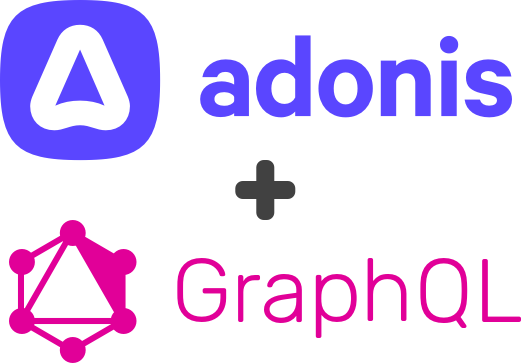

# adonisjs-graphql

<p align="center">

</p>

## Introduction

As a lightweight and straightforward package specifically designed for the AdonisJS web framework, this package focuses on the code-first approach, enabling developers to easily build GraphQL servers directly within their AdonisJS applications.

With an emphasis on simplicity, ease of use, and seamless integration with AdonisJS, it eliminates the need for additional layers such as ExpressJS or Apollo Server. By running directly on the AdonisJS server and tightly integrating with the framework and Lucid ORM, this package can provide a smooth experience for developers looking to implement GraphQL functionality in their projects.

## Features

- **Code-First Approach**: Define your schema using TypeScript classes and decorators.
- **Type Safety**: Leverage TypeScript's static typing to ensure type safety across your schema.
- **Decorators**: Use decorators to define your schema, resolvers, and middleware.
- **Lucid ORM Integration**: Seamlessly integrate with AdonisJS' Lucid ORM to query your database.
- **Middleware**: Define middleware to run before or after your resolvers.
- **Subscriptions**: Use GraphQL subscriptions to push real-time updates to your clients.

## Prerequisites

- This package requires AdonisJS v6

## Installation

Install the package and peer dependencies:

```bash
# Using npm
npm install adonisjs-graphql graphql

# Using yarn
yarn add adonisjs-graphql graphql
```

Configure the package by running the following command:

```bash
node ace configure adonisjs-graphql
```

This will create a new `graphql.ts` file in the `config` directory, where you can define your schema, resolvers, and other settings.

## Usage

Soon

## Contributing

Soon

## License

This package is open-sourced software licensed under the [MIT license](license.md).
